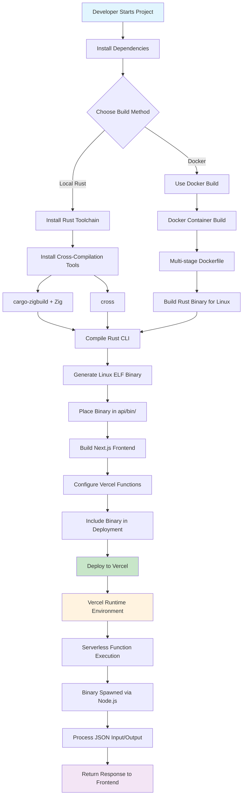

# Vercel Rust Template

A minimal Next.js + Rust CLI template for Vercel deployment with ping functionality.

## Deployment Flow Diagram



## Custom Rust Binary Deployment Template

This template serves as a comprehensive foundation for deploying custom Rust binaries to Vercel's serverless runtime environment. It demonstrates the complete pipeline from local development to production deployment, showcasing how to integrate Rust's performance benefits with Vercel's scalable infrastructure.

## Features

- **Next.js Frontend**: Clean, minimal React interface with Tailwind CSS
- **Rust CLI Binary**: Processes JSON input and returns structured responses
- **Ping Functionality**: Built-in ping/pong testing between frontend and Rust binary
- **Docker Support**: Local compilation using Docker for cross-platform builds
- **Vercel Ready**: Configured for seamless Vercel deployment
- **Automated Build & Deploy**: Single script for complete build and deployment pipeline

## Using This Template for Custom Rust Binary Projects

This template provides a robust foundation for deploying any custom Rust binary to Vercel's serverless environment. Whether you're building data processing tools, image manipulation utilities, cryptographic functions, or any other Rust-based application, this template handles the complex deployment pipeline while you focus on your core business logic.

### Key Benefits for Custom Projects

**Performance at Scale**: Rust binaries deployed through this template leverage Vercel's global edge network, providing sub-100ms cold starts and automatic scaling. Your Rust code runs with native performance while benefiting from serverless infrastructure.

**Zero Infrastructure Management**: Unlike traditional Rust deployments that require managing servers, load balancers, and scaling policies, this template deploys your binary as a serverless function. Vercel handles all infrastructure concerns automatically.

**Cross-Platform Compatibility**: The Docker-based build system ensures your Rust binary works consistently across development environments, regardless of the host operating system or architecture.

**Seamless Integration**: The template provides a clean API layer that allows your Rust binary to communicate with web frontends, mobile applications, or other services through standard HTTP/JSON interfaces.

### Customization Guide

#### 1. Modifying the Rust Binary

The core of your custom project lies in the `rust-cli/src/main.rs` file. This is where you implement your specific business logic:

```rust
// Example: Custom data processing binary
use anyhow::Result;
use serde::{Deserialize, Serialize};
use std::io::{self, Read};

#[derive(Debug, Deserialize)]
struct ProcessingRequest {
    data: Vec<f64>,
    operation: String,
    parameters: Option<serde_json::Value>,
}

#[derive(Debug, Serialize)]
struct ProcessingResponse {
    success: bool,
    result: Option<Vec<f64>>,
    metadata: Option<serde_json::Value>,
    processing_time_ms: u64,
}

fn main() -> Result<()> {
    let mut buffer = String::new();
    io::stdin().read_to_string(&mut buffer)?;

    let request: ProcessingRequest = serde_json::from_str(&buffer)?;
    
    let start_time = std::time::Instant::now();
    
    // Your custom processing logic here
    let result = process_data(&request.data, &request.operation, &request.parameters)?;
    
    let processing_time = start_time.elapsed().as_millis() as u64;
    
    let response = ProcessingResponse {
        success: true,
        result: Some(result),
        metadata: Some(serde_json::json!({
            "operation": request.operation,
            "input_size": request.data.len()
        })),
        processing_time_ms: processing_time,
    };

    println!("{}", serde_json::to_string(&response)?);
    Ok(())
}

fn process_data(data: &[f64], operation: &str, params: &Option<serde_json::Value>) -> Result<Vec<f64>> {
    match operation {
        "sort" => {
            let mut result = data.to_vec();
            result.sort_by(|a, b| a.partial_cmp(b).unwrap());
            Ok(result)
        },
        "filter" => {
            let threshold = params
                .and_then(|p| p.get("threshold"))
                .and_then(|t| t.as_f64())
                .unwrap_or(0.0);
            Ok(data.iter().filter(|&&x| x > threshold).copied().collect())
        },
        _ => Err(anyhow::anyhow!("Unknown operation: {}", operation))
    }
}
```

#### 2. Updating Dependencies

Modify `rust-cli/Cargo.toml` to include any additional dependencies your project requires:

```toml
[package]
name = "cli"
version = "0.1.0"
edition = "2021"

[dependencies]
serde = { version = "1.0", features = ["derive"] }
serde_json = "1.0"
anyhow = "1.0"
# Add your custom dependencies here
tokio = { version = "1.0", features = ["full"] }  # For async operations
image = "0.24"  # For image processing
reqwest = { version = "0.11", features = ["json"] }  # For HTTP requests
```

#### 3. Customizing the API Layer

The `api/proxy.js` file handles communication between the web layer and your Rust binary. You can modify this to add authentication, rate limiting, or custom request/response handling:

```javascript
import { spawn } from 'node:child_process';
import { fileURLToPath } from 'node:url';

export default async function handler(req, res) {
    // Add authentication check
    const authHeader = req.headers.authorization;
    if (!authHeader || !authHeader.startsWith('Bearer ')) {
        return res.status(401).json({ error: 'Unauthorized' });
    }

    // Add rate limiting (example using a simple in-memory store)
    const clientIP = req.headers['x-forwarded-for'] || req.connection.remoteAddress;
    if (isRateLimited(clientIP)) {
        return res.status(429).json({ error: 'Rate limit exceeded' });
    }

    try {
        const chunks = [];
        for await (const chunk of req) {
            chunks.push(chunk);
        }
        const bodyBuffer = Buffer.concat(chunks);
        const bodyString = bodyBuffer.toString('utf8');

        // Validate input size
        if (bodyString.length > 10 * 1024 * 1024) { // 10MB limit
            return res.status(413).json({ error: 'Payload too large' });
        }

        const binaryUrl = new URL('./bin/cli', import.meta.url);
        const binaryPath = fileURLToPath(binaryUrl);

        const child = spawn(binaryPath, { stdio: ['pipe', 'pipe', 'pipe'] });

        child.stdin.write(bodyString);
        child.stdin.end();

        let stdout = '';
        let stderr = '';
        child.stdout.on('data', (d) => (stdout += d.toString('utf8')));
        child.stderr.on('data', (d) => (stderr += d.toString('utf8')));

        child.on('close', (code) => {
            if (code !== 0) {
                console.error('Rust binary failed:', { code, stderr });
                res.status(500).json({ error: 'Processing failed', details: stderr });
                return;
            }
            
            res.setHeader('content-type', 'application/json');
            res.setHeader('cache-control', 'no-cache');
            res.status(200).send(stdout);
        });

        // Add timeout
        const timeout = setTimeout(() => {
            child.kill();
            res.status(504).json({ error: 'Request timeout' });
        }, 30000); // 30 second timeout

        child.on('close', () => clearTimeout(timeout));

    } catch (err) {
        console.error('Proxy error:', err);
        res.status(500).json({ error: 'Internal server error', message: String(err) });
    }
}

// Simple rate limiting function (in production, use Redis or similar)
const requestCounts = new Map();
function isRateLimited(ip) {
    const now = Date.now();
    const windowMs = 60000; // 1 minute
    const maxRequests = 100;

    if (!requestCounts.has(ip)) {
        requestCounts.set(ip, []);
    }

    const requests = requestCounts.get(ip);
    const validRequests = requests.filter(time => now - time < windowMs);
    
    if (validRequests.length >= maxRequests) {
        return true;
    }

    validRequests.push(now);
    requestCounts.set(ip, validRequests);
    return false;
}
```

#### 4. Frontend Customization

The frontend in `pages/index.js` can be customized to match your application's needs:

```javascript
import { useState } from 'react';

export default function Home() {
    const [input, setInput] = useState('');
    const [result, setResult] = useState(null);
    const [loading, setLoading] = useState(false);
    const [error, setError] = useState(null);

    const processData = async () => {
        setLoading(true);
        setError(null);
        
        try {
            const response = await fetch('/api/proxy', {
                method: 'POST',
                headers: {
                    'Content-Type': 'application/json',
                    'Authorization': 'Bearer your-api-token', // Add authentication
                },
                body: JSON.stringify({
                    data: input.split(',').map(Number),
                    operation: 'sort',
                    parameters: { threshold: 0 }
                })
            });

            if (!response.ok) {
                throw new Error(`HTTP error! status: ${response.status}`);
            }

            const data = await response.json();
            setResult(data);
        } catch (err) {
            setError(err.message);
        } finally {
            setLoading(false);
        }
    };

    return (
        <div className="container mx-auto px-4 py-8">
            <h1 className="text-3xl font-bold mb-8">Custom Rust Data Processor</h1>
            
            <div className="max-w-2xl mx-auto">
                <div className="mb-6">
                    <label className="block text-sm font-medium mb-2">
                        Enter comma-separated numbers:
                    </label>
                    <textarea
                        className="w-full p-3 border rounded-lg"
                        rows="4"
                        value={input}
                        onChange={(e) => setInput(e.target.value)}
                        placeholder="1, 5, 3, 9, 2"
                    />
                </div>

                <button
                    onClick={processData}
                    disabled={loading}
                    className="bg-blue-500 text-white px-6 py-2 rounded-lg hover:bg-blue-600 disabled:opacity-50"
                >
                    {loading ? 'Processing...' : 'Process Data'}
                </button>

                {error && (
                    <div className="mt-4 p-4 bg-red-100 border border-red-400 text-red-700 rounded">
                        Error: {error}
                    </div>
                )}

                {result && (
                    <div className="mt-6 p-4 bg-green-100 border border-green-400 text-green-700 rounded">
                        <h3 className="font-bold mb-2">Result:</h3>
                        <pre className="whitespace-pre-wrap">
                            {JSON.stringify(result, null, 2)}
                        </pre>
                    </div>
                )}
            </div>
        </div>
    );
}
```

### Docker Build Process for Custom Binaries

The Docker build process is crucial for ensuring your Rust binary works correctly in Vercel's Linux-based runtime environment. The `Dockerfile` uses a multi-stage build approach:

#### Stage 1: Builder
```dockerfile
FROM ghcr.io/messense/cargo-zigbuild:latest AS builder
WORKDIR /app

# Copy only Cargo.toml first for dependency caching
COPY rust-cli/Cargo.toml ./rust-cli/

# Create a dummy main.rs to cache dependencies
RUN mkdir -p rust-cli/src && \
    echo "fn main() {}" > rust-cli/src/main.rs && \
    cd rust-cli && \
    cargo zigbuild --release --target x86_64-unknown-linux-musl || true

# Copy the actual source code
COPY rust-cli/src/ ./rust-cli/src/

# Build the actual binary
WORKDIR /app/rust-cli
RUN cargo zigbuild --release --target x86_64-unknown-linux-musl
```

This approach optimizes build times by caching dependencies separately from source code changes. The `cargo-zigbuild` tool uses Zig's cross-compilation capabilities to build Linux binaries on any host system.

#### Stage 2: Export
```dockerfile
FROM scratch AS export
COPY --from=builder /app/rust-cli/target/x86_64-unknown-linux-musl/release/cli /cli
```

The export stage creates a minimal image containing only the compiled binary, reducing the final image size and ensuring compatibility with Vercel's deployment process.

### Vercel Configuration for Custom Projects

The `vercel.json` configuration file tells Vercel how to handle your Rust binary:

```json
{
  "outputDirectory": "out",
  "functions": {
    "api/proxy.js": {
      "includeFiles": "api/bin/**"
    }
  }
}
```

This configuration ensures that:
- The Next.js application is built to the `out` directory
- The Rust binary in `api/bin/` is included in the serverless function deployment
- The binary is available at runtime for the proxy function to execute

### Deployment Strategies

#### 1. Automated Deployment
Use the provided build script for automated deployment:

```bash
# Complete build and deployment pipeline
./scripts/build-and-deploy.sh

# Or with verbose output for debugging
./scripts/build-and-deploy.sh --verbose
```

#### 2. Manual Deployment Steps
For more control over the deployment process:

```bash
# 1. Build the Rust binary
npm run build:cli:docker

# 2. Build the Next.js application
npm run build

# 3. Deploy to Vercel
vercel --prod
```

#### 3. CI/CD Integration
For continuous deployment, integrate with GitHub Actions:

```yaml
name: Deploy to Vercel

on:
  push:
    branches: [main]

jobs:
  deploy:
    runs-on: ubuntu-latest
    steps:
      - uses: actions/checkout@v3
      
      - name: Setup Node.js
        uses: actions/setup-node@v3
        with:
          node-version: '22'
          
      - name: Install dependencies
        run: npm install
        
      - name: Build Rust CLI
        run: npm run build:cli:docker
        
      - name: Build Next.js
        run: npm run build
        
      - name: Deploy to Vercel
        uses: amondnet/vercel-action@v25
        with:
          vercel-token: ${{ secrets.VERCEL_TOKEN }}
          vercel-org-id: ${{ secrets.ORG_ID }}
          vercel-project-id: ${{ secrets.PROJECT_ID }}
          vercel-args: '--prod'
```

### Performance Optimization

#### 1. Binary Size Optimization
Add these optimizations to your `Cargo.toml`:

```toml
[profile.release]
opt-level = "z"        # Optimize for size
lto = true            # Link-time optimization
codegen-units = 1     # Single codegen unit for better optimization
panic = "abort"       # Smaller panic handling
strip = true          # Remove debug symbols
```

#### 2. Cold Start Optimization
- Keep your binary under 50MB for optimal cold start performance
- Use static linking (musl target) to avoid dynamic library dependencies
- Minimize dependencies to reduce binary size

#### 3. Memory Optimization
- Use `Box<[T]>` instead of `Vec<T>` for fixed-size collections
- Consider using `smallvec` for small collections that don't need heap allocation
- Use `Cow<str>` for string operations that might not need allocation

### Monitoring and Debugging

#### 1. Logging
Add structured logging to your Rust binary:

```rust
use log::{info, error, warn};
use serde_json;

fn main() -> Result<()> {
    env_logger::init();
    
    let mut buffer = String::new();
    io::stdin().read_to_string(&mut buffer)?;
    
    info!("Processing request: {}", buffer.len());
    
    // Your processing logic here
    
    info!("Request processed successfully");
    Ok(())
}
```

#### 2. Error Handling
Implement comprehensive error handling:

```rust
use anyhow::{Result, Context};

fn process_request(input: &str) -> Result<ProcessingResponse> {
    let request: ProcessingRequest = serde_json::from_str(input)
        .context("Failed to parse JSON input")?;
    
    let result = perform_operation(&request)
        .context("Operation failed")?;
    
    Ok(result)
}
```

#### 3. Performance Monitoring
Add timing information to your responses:

```rust
use std::time::Instant;

fn main() -> Result<()> {
    let start_time = Instant::now();
    
    // Your processing logic here
    
    let processing_time = start_time.elapsed();
    
    let response = Response {
        result: data,
        processing_time_ms: processing_time.as_millis() as u64,
        timestamp: chrono::Utc::now().to_rfc3339(),
    };
    
    println!("{}", serde_json::to_string(&response)?);
    Ok(())
}
```

### Security Considerations

#### 1. Input Validation
Always validate and sanitize inputs:

```rust
fn validate_input(input: &ProcessingRequest) -> Result<()> {
    if input.data.len() > 1_000_000 {
        return Err(anyhow::anyhow!("Input too large"));
    }
    
    if input.data.iter().any(|&x| !x.is_finite()) {
        return Err(anyhow::anyhow!("Invalid numeric values"));
    }
    
    Ok(())
}
```

#### 2. Resource Limits
Implement resource limits to prevent abuse:

```rust
use std::time::Duration;

fn main() -> Result<()> {
    // Set a timeout for the entire operation
    let timeout = Duration::from_secs(30);
    
    // Your processing logic with timeout handling
    Ok(())
}
```

#### 3. Authentication
Implement proper authentication in your API layer:

```javascript
export default async function handler(req, res) {
    // Verify API key or JWT token
    const apiKey = req.headers['x-api-key'];
    if (!apiKey || !isValidApiKey(apiKey)) {
        return res.status(401).json({ error: 'Invalid API key' });
    }
    
    // Rest of your handler logic
}
```

This template provides a solid foundation for deploying any Rust binary to Vercel's serverless environment. By following these guidelines and customizing the components to match your specific needs, you can leverage Rust's performance benefits while enjoying the simplicity and scalability of serverless deployment.

## Deep Dive: Docker Build Process and Vercel Runtime Environment

Understanding the Docker build process and how your Rust binary operates within Vercel's runtime environment is crucial for successful deployment and optimal performance.

### Docker Build Architecture

The Docker build process uses a sophisticated multi-stage approach designed to create optimized, statically-linked Linux binaries that work seamlessly in Vercel's serverless environment.

#### Stage 1: Dependency Caching and Compilation

```dockerfile
FROM ghcr.io/messense/cargo-zigbuild:latest AS builder
WORKDIR /app

# Copy only Cargo.toml first for dependency caching
COPY rust-cli/Cargo.toml ./rust-cli/

# Create a dummy main.rs to cache dependencies
RUN mkdir -p rust-cli/src && \
    echo "fn main() {}" > rust-cli/src/main.rs && \
    cd rust-cli && \
    cargo zigbuild --release --target x86_64-unknown-linux-musl || true
```

This stage implements a clever caching strategy:

1. **Dependency Isolation**: By copying only `Cargo.toml` first, Docker can cache the dependency download and compilation step separately from source code changes.

2. **Dummy Source Trick**: Creating a minimal `main.rs` allows Cargo to resolve and compile all dependencies without requiring the actual source code. This means dependency compilation only happens when `Cargo.toml` changes.

3. **Cross-Compilation Setup**: The `cargo-zigbuild` tool uses Zig's cross-compilation capabilities to build Linux binaries on any host system (macOS, Windows, Linux).

#### Stage 2: Source Code Compilation

```dockerfile
# Copy the actual source code
COPY rust-cli/src/ ./rust-cli/src/

# Build the actual binary
WORKDIR /app/rust-cli
RUN cargo zigbuild --release --target x86_64-unknown-linux-musl
```

This stage replaces the dummy source with your actual code and compiles the final binary:

1. **Source Replacement**: The actual source code overwrites the dummy file, triggering a rebuild of only the application code.

2. **Optimized Compilation**: The `--release` flag enables all optimizations, including:
   - Dead code elimination
   - Inlining optimizations
   - Loop optimizations
   - Link-time optimization (LTO)

3. **Static Linking**: The `x86_64-unknown-linux-musl` target creates a statically-linked binary that doesn't depend on system libraries.

#### Stage 3: Binary Extraction

```dockerfile
FROM scratch AS export
COPY --from=builder /app/rust-cli/target/x86_64-unknown-linux-musl/release/cli /cli
```

The final stage creates a minimal image containing only the compiled binary:

1. **Minimal Image**: Using `FROM scratch` creates the smallest possible image with no base operating system.

2. **Single Binary**: Only the compiled binary is included, reducing the final image size to just a few megabytes.

3. **Clean Export**: The binary is placed at the root level (`/cli`) for easy extraction.

### Why This Docker Approach Works

#### Cross-Platform Compatibility
The Docker build ensures your Rust binary works consistently across all development environments:

- **macOS Development**: Developers can build Linux binaries without installing Linux toolchains
- **Windows Development**: Windows developers can build Linux binaries using Docker Desktop
- **CI/CD Environments**: Build servers can compile binaries regardless of their host OS

#### Static Linking Benefits
The `musl` target creates statically-linked binaries with several advantages:

1. **No External Dependencies**: The binary includes all necessary libraries, eliminating dependency conflicts
2. **Consistent Behavior**: The binary behaves identically across different Linux distributions
3. **Simplified Deployment**: No need to install additional libraries on the target system

#### Build Optimization
The multi-stage approach provides significant performance benefits:

1. **Faster Iterations**: Source code changes don't trigger dependency recompilation
2. **Efficient Caching**: Docker layers cache intermediate build artifacts
3. **Parallel Builds**: Multiple developers can share cached dependency layers

### Vercel Runtime Environment

Understanding how your Rust binary operates within Vercel's serverless environment is essential for optimal performance and debugging.

#### Serverless Function Execution Model

Vercel's serverless functions operate on a request-response model:

1. **Cold Start**: When a function hasn't been used recently, Vercel spins up a new container
2. **Warm Execution**: Subsequent requests reuse the existing container for faster response times
3. **Auto-scaling**: Vercel automatically scales the number of containers based on demand

#### Binary Execution Process

Your Rust binary executes through the following process:

```javascript
// From api/proxy.js
const child = spawn(binaryPath, { stdio: ['pipe', 'pipe', 'pipe'] });
child.stdin.write(bodyString);
child.stdin.end();
```

1. **Process Spawning**: Node.js spawns your Rust binary as a child process
2. **Input Streaming**: JSON input is streamed to the binary's stdin
3. **Output Capture**: The binary's stdout is captured and returned as the HTTP response
4. **Error Handling**: stderr is captured for error reporting

#### Performance Characteristics

#### Cold Start Performance
- **Binary Size Impact**: Smaller binaries (< 50MB) start faster
- **Static Linking**: Eliminates dynamic library loading overhead
- **Memory Allocation**: Rust's zero-cost abstractions minimize memory overhead

#### Warm Execution Performance
- **Process Reuse**: Subsequent requests reuse the existing binary process
- **Memory Persistence**: Global variables and caches persist between requests
- **CPU Optimization**: Rust's compiled code runs at near-native speed

#### Resource Limits

Vercel imposes several limits on serverless functions:

1. **Execution Time**: 10 seconds for Hobby plan, 60 seconds for Pro plan
2. **Memory**: 1GB maximum memory allocation
3. **Payload Size**: 4.5MB request payload limit
4. **Response Size**: 4.5MB response payload limit

#### Optimization Strategies

#### Binary Size Optimization
```toml
# In Cargo.toml
[profile.release]
opt-level = "z"        # Optimize for size over speed
lto = true            # Link-time optimization
codegen-units = 1     # Single codegen unit for better optimization
panic = "abort"       # Smaller panic handling
strip = true          # Remove debug symbols
```

#### Memory Optimization
```rust
// Use stack allocation when possible
let mut buffer = [0u8; 1024]; // Stack-allocated array

// Use Box for heap allocation only when necessary
let large_data = Box::new(vec![0; 1_000_000]);

// Use Cow for string operations that might not need allocation
use std::borrow::Cow;
fn process_string(s: &str) -> Cow<str> {
    if s.len() > 10 {
        Cow::Owned(s.to_uppercase())
    } else {
        Cow::Borrowed(s)
    }
}
```

#### Execution Time Optimization
```rust
use std::time::Instant;

fn main() -> Result<()> {
    let start_time = Instant::now();
    
    // Your processing logic here
    
    let elapsed = start_time.elapsed();
    if elapsed.as_secs() > 5 {
        eprintln!("Warning: Processing took {} seconds", elapsed.as_secs());
    }
    
    Ok(())
}
```

### Debugging in Production

#### Logging Strategy
```rust
use log::{info, warn, error};
use serde_json;

fn main() -> Result<()> {
    // Initialize logging
    env_logger::Builder::from_default_env()
        .filter_level(log::LevelFilter::Info)
        .init();
    
    let mut buffer = String::new();
    io::stdin().read_to_string(&buffer)?;
    
    info!("Received request of {} bytes", buffer.len());
    
    // Your processing logic here
    
    info!("Request processed successfully");
    Ok(())
}
```

#### Error Handling
```rust
use anyhow::{Result, Context};

fn process_request(input: &str) -> Result<ProcessingResponse> {
    let request: ProcessingRequest = serde_json::from_str(input)
        .context("Failed to parse JSON input")?;
    
    validate_input(&request)
        .context("Input validation failed")?;
    
    let result = perform_operation(&request)
        .context("Operation failed")?;
    
    Ok(result)
}

fn validate_input(request: &ProcessingRequest) -> Result<()> {
    if request.data.len() > 1_000_000 {
        return Err(anyhow::anyhow!("Input too large: {} elements", request.data.len()));
    }
    
    if request.data.iter().any(|&x| !x.is_finite()) {
        return Err(anyhow::anyhow!("Invalid numeric values in input"));
    }
    
    Ok(())
}
```

#### Performance Monitoring
```rust
use std::time::Instant;

fn main() -> Result<()> {
    let start_time = Instant::now();
    
    let mut buffer = String::new();
    io::stdin().read_to_string(&buffer)?;
    
    let parse_time = Instant::now();
    let request: ProcessingRequest = serde_json::from_str(&buffer)?;
    let parse_duration = parse_time.elapsed();
    
    let process_time = Instant::now();
    let result = process_data(&request)?;
    let process_duration = process_time.elapsed();
    
    let total_duration = start_time.elapsed();
    
    let response = ProcessingResponse {
        result,
        timing: TimingInfo {
            parse_time_ms: parse_duration.as_millis() as u64,
            process_time_ms: process_duration.as_millis() as u64,
            total_time_ms: total_duration.as_millis() as u64,
        },
    };
    
    println!("{}", serde_json::to_string(&response)?);
    Ok(())
}
```

### Advanced Deployment Patterns

#### Multi-Binary Deployment
For complex applications requiring multiple binaries:

```json
// vercel.json
{
  "outputDirectory": "out",
  "functions": {
    "api/proxy.js": {
      "includeFiles": "api/bin/**"
    },
    "api/image-processor.js": {
      "includeFiles": "api/bin/image-processor"
    },
    "api/data-analyzer.js": {
      "includeFiles": "api/bin/data-analyzer"
    }
  }
}
```

#### Environment-Specific Builds
```dockerfile
# Build different binaries for different environments
FROM ghcr.io/messense/cargo-zigbuild:latest AS builder

ARG BUILD_ENV=production
ENV BUILD_ENV=${BUILD_ENV}

WORKDIR /app
COPY rust-cli/ ./

RUN if [ "$BUILD_ENV" = "development" ]; then \
        cargo zigbuild --target x86_64-unknown-linux-musl; \
    else \
        cargo zigbuild --release --target x86_64-unknown-linux-musl; \
    fi
```

#### Custom Build Scripts
```bash
#!/bin/bash
# scripts/build-multiple.sh

# Build different binaries for different purposes
docker build --target export -f docker/cli.Dockerfile -o api/bin/cli .
docker build --target export -f docker/image-processor.Dockerfile -o api/bin/image-processor .
docker build --target export -f docker/data-analyzer.Dockerfile -o api/bin/data-analyzer .

# Verify all binaries
for binary in api/bin/*; do
    if [ -f "$binary" ]; then
        echo "✅ $binary built successfully"
        file "$binary"
    else
        echo "❌ $binary failed to build"
        exit 1
    fi
done
```

This comprehensive understanding of the Docker build process and Vercel runtime environment enables you to create robust, performant Rust applications that leverage the full power of serverless deployment while maintaining the performance benefits of compiled Rust code.

## Prerequisites

### Required for Local Development & Deployment

#### Core Dependencies
- **Node.js**: Version 22.x (as specified in package.json engines)
- **Package Manager**: Choose one:
  - **npm**: Comes with Node.js (default)
  - **yarn**: Alternative package manager (recommended for faster installs)
- **Git**: For version control and Vercel CLI authentication

#### For Rust CLI Compilation (Choose One Option)

**Option A: Local Rust Toolchain (Recommended for Development)**
- **Rust**: Latest stable version via rustup
- **Cross-compilation tools** (choose one):
  - **cargo-zigbuild** + **Zig**: For macOS/Linux cross-compilation
  - **cross**: Alternative cross-compilation tool

**Option B: Docker (No Local Rust Required)**
- **Docker**: For containerized builds
- **Docker BuildKit**: Enabled for optimized builds

#### For Vercel Deployment
- **Vercel CLI**: For deployment automation
- **Vercel Account**: With project linked
- **Environment Variables**: Any required secrets/API keys

### Platform-Specific Installation

#### macOS (OSX)
```bash
# Install Homebrew (if not already installed)
/bin/bash -c "$(curl -fsSL https://raw.githubusercontent.com/Homebrew/install/HEAD/install.sh)"

# Install Node.js (via Homebrew)
brew install node@22

# Install Rust
curl --proto '=https' --tlsv1.2 -sSf https://sh.rustup.rs | sh
source ~/.cargo/env

# Install cross-compilation tools (choose one)
# Option 1: cargo-zigbuild + Zig (recommended)
cargo install cargo-zigbuild
brew install zig

# Option 2: cross
cargo install cross --git https://github.com/cross-rs/cross

# Install Docker (if using Docker option)
brew install --cask docker

# Install Vercel CLI
npm install -g vercel
# or with yarn
yarn global add vercel
```

#### Linux (Ubuntu/Debian)
```bash
# Update package manager
sudo apt update

# Install Node.js 22.x
curl -fsSL https://deb.nodesource.com/setup_22.x | sudo -E bash -
sudo apt-get install -y nodejs

# Install Rust
curl --proto '=https' --tlsv1.2 -sSf https://sh.rustup.rs | sh
source ~/.cargo/env

# Install cross-compilation tools (choose one)
# Option 1: cargo-zigbuild + Zig
cargo install cargo-zigbuild
sudo apt install zig

# Option 2: cross
cargo install cross --git https://github.com/cross-rs/cross

# Install Docker (if using Docker option)
sudo apt install docker.io
sudo systemctl start docker
sudo systemctl enable docker
sudo usermod -aG docker $USER

# Install Vercel CLI
sudo npm install -g vercel
# or with yarn
sudo yarn global add vercel
```

## Package Manager: npm vs yarn

This project supports both **npm** and **yarn** package managers. Choose based on your preference:

### npm (Default)
- **Pros**: Comes with Node.js, widely supported, stable
- **Cons**: Slower installs, larger lock files
- **Usage**: `npm install`, `npm run <script>`

### yarn (Recommended)
- **Pros**: Faster installs, better dependency resolution, smaller lock files
- **Cons**: Additional installation step
- **Usage**: `yarn install`, `yarn <script>`

### Installing yarn
```bash
# Install yarn globally
npm install -g yarn
# or via Homebrew (macOS)
brew install yarn
# or via apt (Linux)
curl -sS https://dl.yarnpkg.com/debian/pubkey.gpg | sudo apt-key add -
echo "deb https://dl.yarnpkg.com/debian/ stable main" | sudo tee /etc/apt/sources.list.d/yarn.list
sudo apt update && sudo apt install yarn
```

## Quick Start

### Automated Build & Deploy (Recommended)

**Using npm:**
```bash
# Single command for complete build and deployment
npm run build:deploy
```

**Using yarn:**
```bash
# Single command for complete build and deployment
yarn run build:deploy
```

**Direct script execution:**
```bash
# Make the script executable (first time only)
chmod +x scripts/build-and-deploy.sh

# Run complete build and deployment
./scripts/build-and-deploy.sh
```

### Manual Development Workflow

1. **Install dependencies**:
   ```bash
   # Using npm
   npm install
   
   # Using yarn
   yarn install
   ```

2. **Build the Rust CLI locally** (requires Rust toolchain):
   ```bash
   # Using npm
   npm run build:cli
   
   # Using yarn
   yarn run build:cli
   ```

3. **Or build using Docker** (no local Rust required):
   ```bash
   # Using npm
   npm run build:cli:docker
   
   # Using yarn
   yarn run build:cli:docker
   ```

4. **Start development server**:
   ```bash
   # Using npm
   npm run dev
   
   # Using yarn
   yarn dev
   ```

5. **Build for production**:
   ```bash
   # Using npm
   npm run build
   
   # Using yarn
   yarn build
   ```

6. **Deploy to Vercel**:
   ```bash
   vercel --prod
   ```

## How it Works

### Ping Test
- Click "Ping Rust Binary" to test the connection
- Sends a structured ping message with timestamp
- Rust binary responds with pong confirmation

### Custom Messages
- Enter a custom message in the text area
- Click "Send Custom Message" to process it
- Message is sent to Rust CLI binary via `/api/proxy` endpoint
- Rust binary processes input and returns JSON response

### Architecture
- **Frontend**: Next.js with React hooks for state management
- **API**: `/api/proxy.js` spawns Rust binary and handles I/O
- **Rust CLI**: Processes JSON input, handles ping/pong, echoes messages
- **Deployment**: Vercel functions with binary included in deployment

## Local Development Setup

### Option 1: Local Rust Toolchain
```bash
# Install Rust
curl --proto '=https' --tlsv1.2 -sSf https://sh.rustup.rs | sh

# Install cargo-zigbuild (recommended)
cargo install cargo-zigbuild
brew install zig  # macOS

# Build CLI
# Using npm
npm run build:cli
# Using yarn
yarn run build:cli
```

### Option 2: Docker (No Local Rust Required)
```bash
# Just need Docker running
# Using npm
npm run build:cli:docker
# Using yarn
yarn run build:cli:docker
```

## Deployment

1. **Build the CLI binary**:
   ```bash
   # Using npm
   npm run build:cli:docker
   
   # Using yarn
   yarn run build:cli:docker
   ```

2. **Deploy to Vercel**:
   ```bash
   vercel --prod
   ```

The binary will be automatically included in the Vercel function deployment.

## yarn run build:deploy - Complete Guide

The `yarn run build:deploy` command is a comprehensive automation script that handles the entire build and deployment pipeline. Here's everything you need to know:

### What it does
1. **Validates Prerequisites**: Checks for Node.js, yarn, Git, Rust toolchain, Docker, and Vercel CLI
2. **Installs Dependencies**: Runs `yarn install` to install all Node.js dependencies
3. **Builds Rust CLI**: Compiles the Rust binary using the best available method
4. **Builds Next.js App**: Compiles the frontend for production
5. **Validates Build**: Ensures all components are properly built
6. **Deploys to Vercel**: Pushes the complete application to production

### Prerequisites
Before running `yarn run build:deploy`, ensure you have:

- **Node.js 22.x**: `node --version`
- **yarn**: `yarn --version`
- **Git**: `git --version`
- **Rust toolchain** (for local builds): `rustc --version`
- **Docker** (for Docker builds): `docker --version`
- **Vercel CLI**: `vercel --version`
- **Vercel Authentication**: `vercel whoami`

### Usage Examples

**Basic deployment:**
```bash
yarn run build:deploy
```

**Verbose output (recommended for debugging):**
```bash
yarn run build:deploy:verbose
```

**Step-by-step process:**
```bash
# 1. Install dependencies
yarn install

# 2. Build Rust CLI (choose one)
yarn run build:cli          # Local Rust toolchain
yarn run build:cli:docker   # Docker build

# 3. Build Next.js app
yarn build

# 4. Deploy to Vercel
vercel --prod
```

### Troubleshooting yarn run build:deploy

**Common Issues:**

1. **yarn not found:**
   ```bash
   # Install yarn globally
   npm install -g yarn
   ```

2. **Vercel not authenticated:**
   ```bash
   vercel login
   vercel whoami  # Verify authentication
   ```

3. **Rust toolchain missing:**
   ```bash
   # Install Rust
   curl --proto '=https' --tlsv1.2 -sSf https://sh.rustup.rs | sh
   source ~/.cargo/env
   ```

4. **Docker not running:**
   ```bash
   # Start Docker service
   brew services start docker  # macOS
   sudo systemctl start docker  # Linux
   ```

5. **Permission issues:**
   ```bash
   # Fix script permissions
   chmod +x scripts/build-and-deploy.sh
   ```

### Environment Variables
The script automatically handles:
- Node.js environment detection
- Rust toolchain detection
- Docker availability
- Vercel authentication status

### Output
The script provides:
- ✅ Success indicators for each step
- ❌ Error messages with troubleshooting hints
- 📊 Build statistics and timing
- 🔗 Deployment URL upon completion

## Automated Build & Deploy Script

The `scripts/build-and-deploy.sh` script provides a complete automation pipeline that:

### Prerequisites Validation
- ✅ **Node.js**: Checks for Node.js 22.x installation
- ✅ **npm**: Validates npm availability
- ✅ **Git**: Ensures Git is installed for Vercel authentication
- ✅ **Rust Toolchain**: Validates Rust installation and toolchain
- ✅ **Cross-compilation**: Checks for cargo-zigbuild or cross
- ✅ **Docker**: Validates Docker installation (if using Docker build)
- ✅ **Vercel CLI**: Ensures Vercel CLI is installed and authenticated

### Build Process
1. **Dependency Installation**: Runs `npm install` to install Node.js dependencies
2. **Rust CLI Compilation**: Builds the Rust binary using the best available method:
   - Prefers local Rust toolchain with cargo-zigbuild
   - Falls back to Docker build if local Rust unavailable
3. **Next.js Build**: Compiles the Next.js application for production
4. **Binary Validation**: Ensures the compiled binary is executable and properly placed

### Deployment Process
1. **Vercel Authentication**: Validates Vercel CLI authentication
2. **Production Deployment**: Deploys to Vercel with `--prod` flag
3. **Deployment Verification**: Confirms successful deployment

### Usage

**Direct Script Execution:**
```bash
# Make the script executable (first time only)
chmod +x scripts/build-and-deploy.sh

# Run complete build and deployment
./scripts/build-and-deploy.sh

# Or run with verbose output
./scripts/build-and-deploy.sh --verbose
```

**Package Manager Scripts (Alternative):**
```bash
# Using npm
npm run build:deploy
npm run build:deploy:verbose

# Using yarn
yarn run build:deploy
yarn run build:deploy:verbose
```

### Platform Support
- **macOS (OSX)**: Primary target with Homebrew package manager
- **Linux**: Ubuntu/Debian support with apt package manager
- **Auto-detection**: Automatically detects OS and adjusts commands accordingly

## Project Structure

```
├── pages/
│   ├── index.js          # Main React component with ping/message UI
│   └── _app.js           # Next.js app wrapper
├── api/
│   ├── proxy.js          # Vercel function that spawns Rust binary
│   └── bin/              # Compiled Rust CLI binary (generated)
├── rust-cli/
│   ├── Cargo.toml        # Rust dependencies
│   └── src/main.rs       # Rust CLI with ping/pong logic
├── scripts/
│   ├── build-cli.sh      # Local build script
│   ├── build-cli-docker.sh # Docker build script
│   └── build-and-deploy.sh # Complete build & deploy automation
├── docker/
│   └── cli.Dockerfile    # Docker build for Rust binary
├── package.json          # Node.js dependencies and scripts
├── vercel.json           # Vercel configuration
└── README.md             # This file
```

## Troubleshooting

### Common Issues

**Missing Cross-Compilation Tools**
```bash
# Install cargo-zigbuild (recommended)
cargo install cargo-zigbuild
brew install zig  # macOS
sudo apt install zig  # Linux
```

**Docker Not Running**
```bash
# Start Docker service
brew services start docker  # macOS
sudo systemctl start docker  # Linux
```

**Vercel Authentication Issues**
```bash
# Login to Vercel
vercel login

# Check authentication status
vercel whoami
```

**Node.js Version Mismatch**
```bash
# Check current version
node --version

# Install Node.js 22.x if needed
brew install node@22  # macOS
curl -fsSL https://deb.nodesource.com/setup_22.x | sudo -E bash - && sudo apt-get install -y nodejs  # Linux
```

**Binary Not Executable**
```bash
# Fix permissions
chmod +x api/bin/cli
```

### Script Debugging

**Enable Verbose Output**
```bash
./scripts/build-and-deploy.sh --verbose
# or
npm run build:deploy:verbose
# or
yarn run build:deploy:verbose
```

**Check Individual Components**
```bash
# Test Rust CLI build only
npm run build:cli
# or
yarn run build:cli

# Test Docker build only
npm run build:cli:docker
# or
yarn run build:cli:docker

# Test Next.js build only
npm run build
# or
yarn build
```

## Customization

- **Frontend**: Modify `pages/index.js` for UI changes
- **Rust Logic**: Update `rust-cli/src/main.rs` for custom processing
- **API**: Modify `api/proxy.js` for different binary interaction patterns
- **Styling**: Update `styles/globals.css` for custom Tailwind styles